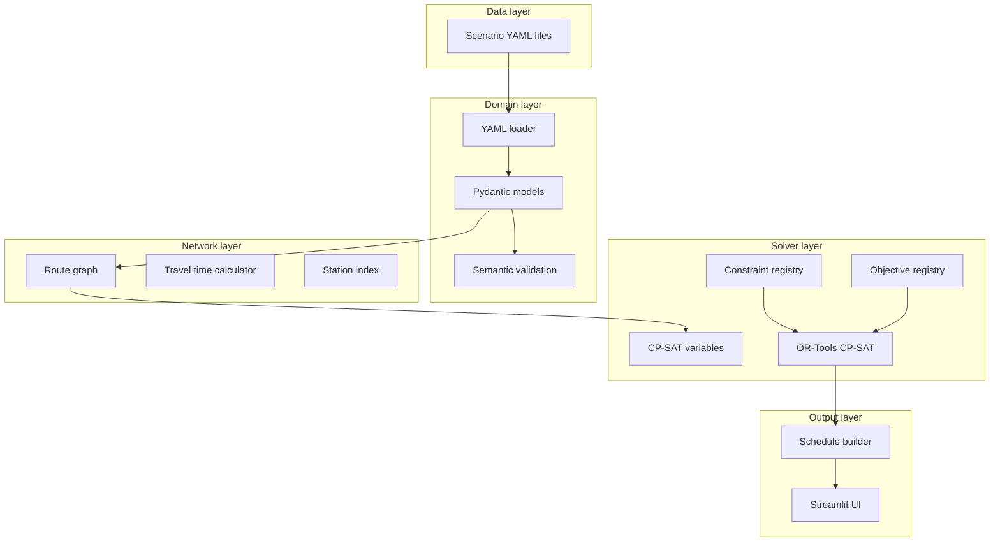

# Architecture

Bus charging scheduler is a **scenario-driven**, **constraint-based** optimization system. All fleet topology and policy weights live in YAML; the Python code provides engines and registries, not hardcoded station or operator names.

## System layers

## Package layout

| Package / path | Responsibility |
|----------------|----------------|
| `bus_charging_scheduler/domain/` | Typed scenario entities (`Scenario`, `Bus`, `Station`, …) |
| `bus_charging_scheduler/scenarios/` | Load YAML, validate referential integrity |
| `bus_charging_scheduler/network/` | Directed legs, travel minutes, station lookup |
| `bus_charging_scheduler/solver/` | CP-SAT model, constraint & objective registries |
| `bus_charging_scheduler/output/` | Timetables and station charging orders |
| `bus_charging_scheduler/ui/` | Streamlit application |
| `data/scenarios/` | Scenario configuration (no code changes per fleet) |

## Scheduling model (CP-SAT)

Time is discretized into **slots** (`scheduling.time_slot_minutes`) over a **horizon** (`scheduling.horizon_minutes`).

For each bus and each **visit** (station stop along its route):

- `arrival_slots[v]` — when the bus reaches the station  
- `charge_duration_slots[v]` — charging interval length (also an `IntervalVar` for capacity)  
- `departure_slots[v]` — when the bus leaves (`arrival + charge`)  
- `soc_at_departure_deci_kwh[v]` — integer SOC (0.1 kWh units) after charging  

Legs connect visits: `departure[v] + travel_slots(leg v) = arrival[v+1]`.

### Constraint registry

| Rule | Module | Purpose |
|------|--------|---------|
| Route order | `solver/constraints/route_order.py` | Leg timing and dwell = charge time |
| Charger capacity | `solver/constraints/charger_capacity.py` | `AddCumulative` per station |
| Battery range | `solver/constraints/battery_range.py` | SOC feasibility along the route |

### Objective registry

| Objective | Module | Minimizes |
|-----------|--------|-----------|
| Individual delay | `solver/objectives/individual_delay.py` | Completion beyond minimum drive time |
| Operator fairness | `solver/objectives/operator_fairness.py` | Spread of completion times per operator |
| Network efficiency | `solver/objectives/network_efficiency.py` | Total charging duration |

Weights come from `weights` in the scenario file. See [EXTENDING.md](EXTENDING.md) for adding rules or objectives.

## Data flow

1. **Load** — `load_scenario(path)` → `Scenario`  
2. **Network** — `build_route_graph(scenario)` → `RouteGraph` with `travel_minutes` per leg  
3. **Solve** — `solve_scenario(scenario)` → `SolverResult` (slot-based timings + charging sessions)  
4. **Present** — `build_schedule(scenario, result)` → `Schedule` (minutes, ranked station queues)  
5. **UI** — `solve_and_build_schedule` drives Streamlit tables  

## Design principles

- **No hardcoded topology** — station IDs, route distances, and operators are YAML-only.  
- **Registries** — new constraints/objectives register callables; default registries stay small.  
- **Two-phase validation** — Pydantic for structure; `validate_scenario()` for cross-references.  
- **Separation of solver vs output** — OR-Tools types do not leak into timetable models.  

## Example scenarios

| File | Demonstrates |
|------|----------------|
| `minimal_valid.yaml` | Single bus, round trip, baseline |
| `multi_charger_hub.yaml` | Hub with 4 chargers, multiple buses |
| `two_operators_fairness.yaml` | Two operators, fairness-oriented weights |
| `three_station_loop.yaml` | Extra intermediate station on a route |
